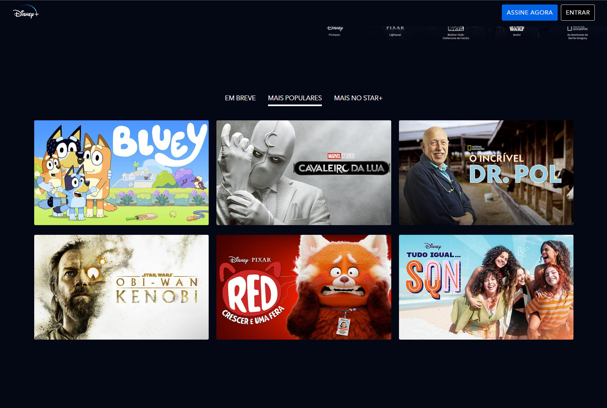

# DISNNEY+ - clone


This application is a clone of the Disney+ landing page. It features tab selection to view what is available on the site, a toggle function for the FAQ section, and a mobile version.

## Index
- <a href="#functionalities">Application functionalities</a>
- <a href="#layout">Layout</a>
- <a href="#demonstration">Demonstration</a>
- <a href="#run">How to run the application</a>
- <a href="#tecnologies-used">Tecnologies used</a>
- <a href="#developer">Developer</a>
- <a href="#next-steps">Next steps</a>

## Application functionalities
 - [x]  Navigation through films/shows lists  
 - [x]  Show/hidde the answers in the FAQ section
 - [x]  Compatibility with different screen sizes

## Layout
1. Desktop


<br/>
<br/>

<br/>
<br/>

<br/>
<br/>

<br/>
<br/>

<br/>
<br/>

<br/>
<br/>

<br/>
<br/>

<br/>
<br/>

<br/>
<br/>

2. Mobile

https://github.com/Julia-slvbrg/disney-plus-landingpage/assets/114543081/bc4bce1c-c622-4c8a-8d78-673feb6cbc25


## Demonstration

[Link (deploy)](https://clone-disney-plus-landingpage.vercel.app/)


## How to run the application
```bash
# Clone this repository
$ git clone repolink

# Acess the app folder on your terminal
$ cd disney-plus-landingpage

# Install the dependencies
$ npm install

# Run the app 
$ npm run build

# Acesse a apicação pelo navegador:
http://127.0.0.1:5173/
```

## Tecnologies used
1. HTML 
2. SASS 
3. BEM methodology
4. Javascript
5. Gulp
6. Gupl Imagemin
7. Gupl Uglify
8. Media Query

## Developer
[LinkedIn](https://www.linkedin.com/in/julia-silva-borges/)
